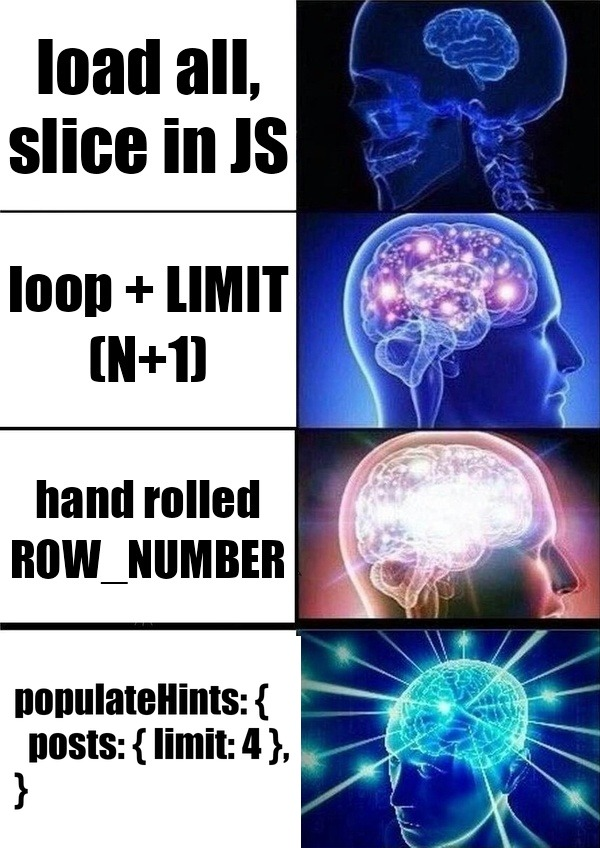

import Tabs from '@theme/Tabs';
import TabItem from '@theme/TabItem';

[MikroORM v7.1](https://github.com/mikro-orm/mikro-orm/releases/tag/v7.1.0) is out. The first minor on top of [v7](https://mikro-orm.io/blog/mikro-orm-7-released) is a feature-packed one — a new relation flavor, per-parent collection limiting, database triggers, PostgreSQL partitioning, union-target polymorphic M:N, server-side row cloning, query cancellation via `AbortSignal`, stored procedures and functions, a new PGlite driver, typed Kysely across DI-driven projects, and a lot more. Let's go through the highlights.


<!--truncate-->

## `LazyRef<T>` — a new relation flavor

MikroORM has had two ways to type to-one relations for a long time: plain entity references (which pretend the relation is always there at the type level, even when it's not loaded) and `Ref<T>`/`Reference<T>` (which force you to go through `.$` or `.get()` even after you loaded them).

v7.1 introduces a third option: `LazyRef<T>`. It is a **type-only marker** — the runtime is a plain entity, `instanceof` still returns `true`, there's no `.$` or `.get()` indirection. TypeScript restricts access to the primary key until `Loaded<>` narrows it back to the full entity:

```ts
@ManyToOne(() => Author)
author!: LazyRef<Author>;

// or via defineEntity:
author: () => p.manyToOne(AuthorSchema).lazyRef()

book.author.id;                          // ok — PK is always accessible
book.author.name;                        // compile error — not loaded

const loaded = await em.findOneOrFail(Book, 1, { populate: ['author'] });
loaded.author.name;                      // ok — Loaded<> strips the brand
```

Two related additions round out the story:

The **`Loadable` mixin** adds `load()` / `loadOrFail()` to an entity's prototype — Reference-style ergonomics for direct and LazyRef-typed relations. It ships as `Loadable(Base)` plus a pre-composed `LoadableBaseEntity`. `BaseEntity` itself is deliberately untouched so the `load`/`loadOrFail` names stay free on your existing subclasses:

```ts
class User extends LoadableBaseEntity { /* ... */ }
await user.load();          // Promise<User | null>
await user.loadOrFail();    // Promise<User>
```

The **`unref()`** helper is a typed escape hatch — the inverse of the existing `ref()` helper. It narrows `Ref<T> | LazyRef<T> | T` down to `T` for cases where you know the relation is populated but can't thread `Loaded<>` through a function signature:

```ts
import { unref } from '@mikro-orm/core';

function logAuthor(book: Book) {
  // book.author is typed as LazyRef<Author> — .name would be a compile error
  console.log(unref(book.author).name);
}
```

All three additions are opt-in and non-breaking. `BaseEntity`, `Ref<T>`, plain relations and `@ManyToOne({ ref: true })` are unchanged. See [type-safe relations](/docs/type-safe-relations#lazyreft--type-only-reference) for the full reference.

## Per-parent limiting for populated collections

A long-requested feature ([#1059](https://github.com/mikro-orm/mikro-orm/issues/1059)) has finally landed. You can now limit how many items each parent gets in a populated collection — e.g. "4 most recent posts per user":

```ts
const users = await em.find(User, {}, {
  populate: ['posts'],
  populateHints: {
    posts: { limit: 4, orderBy: { createdAt: 'desc' } },
  },
});
```

On SQL, this uses `ROW_NUMBER() OVER (PARTITION BY <fk> ORDER BY ...)` wrapped in a subquery. On MongoDB, it uses a `$group` / `$push` / `$slice` aggregation pipeline. Limited collections are marked partial and read-only so the Unit of Work doesn't try to delete unloaded items, and the `joined` strategy automatically falls back to `select-in` when a limit is set. See [loading strategies](/docs/loading-strategies#per-parent-limiting) for the full reference.



## Type-safe index hints via `using`

A new `using` option in `FindOptions` validates `where` / `orderBy` against named indexes and emits driver-specific SQL hints:

```ts
const users = await em.find(User, { name: 'foo' }, {
  using: 'idx_user_name',
});

// also accepts an array of indexes
em.find(User, { name: 'foo' }, { using: ['idx_user_name', 'uniq_user_email'] });
```

The type system narrows `where` to only allow properties covered by the named index(es), and the index name itself is checked against your entity's declared indexes. For `defineEntity`, index names are inferred automatically from `.index('name')` / `.unique('name')` calls; for decorator entities you declare them via the `[IndexHints]` symbol (same pattern as `[PrimaryKeyProp]`).

Driver support includes MySQL/MariaDB (`USE INDEX`), MSSQL (`WITH (INDEX(...))`), MongoDB (passed as the `hint` option), and validation-only on PostgreSQL/SQLite/libSQL. The existing `indexHint` option still works and takes precedence when explicitly set. See [indexes](/docs/indexes) for the full reference.

## Partial indexes via `where`

`@Index` / `@Unique` (and the `defineEntity` / `EntitySchema` equivalents) now accept a portable `where` predicate — e.g. for a soft-delete-aware unique index on `email`:

```ts
@Unique({ properties: ['email'], where: { deletedAt: null } })
```

The object form is portable across drivers; raw SQL strings are also accepted when you need driver-specific syntax.

Per-driver output:

| Driver        | Output                                                                     |
|---------------|----------------------------------------------------------------------------|
| PostgreSQL    | native partial index: `create unique index ... where "deleted_at" is null` |
| SQLite        | native partial index                                                       |
| MSSQL         | native partial index                                                       |
| MySQL 8.0.13+ | functional index: `((case when deleted_at is null then email end))`        |
| Oracle        | functional index, same shape as MySQL                                      |
| MongoDB       | `partialFilterExpression` (object form only)                               |
| MariaDB       | throws — no inline expression indexes; use a virtual generated column      |

The `CASE WHEN` trick on MySQL/Oracle works because `NULL` is distinct in unique indexes — rows where the predicate is false get a `NULL` key and don't conflict.

Predicates are diffed **structurally** through the same expression normalizer the schema generator uses for check constraints (collapsing whitespace, quoting, and casing), so there's no name-only fallback and the output round-trips cleanly through the entity generator. See [partial indexes](/docs/indexes#partial-indexes) for the full reference.

## Typed Kysely across DI-driven projects

One of the headline type-safety wins in v7 was that `em.getKysely()` returns a fully-typed Kysely instance — but only when the ORM knows your entities at the type level. With `defineEntity`, that happens automatically. With decorators, you get it by listing entity classes directly in `MikroOrmConfig['entities']` so the array's element type is the union of those classes.

The catch is that in a lot of real-world setups, the root ORM config simply isn't where the entity classes live:

- **NestJS** projects typically split entity registration across feature modules via `MikroOrmModule.forFeature([Entity])` and leave `forRoot({ entities: [...] })` either empty or pointed at a glob. The type-level view of "all entities" never exists in a single place.
- **Fastify / Encore / Nitro / any other DI-flavored framework** with module-based bootstrapping has the same shape — the root config is loaded first, before the modules that own the classes.
- **Folder discovery** (`entities: ['./dist/**/*.entity.js']`) is the dominant pattern even outside DI containers, and globs erase the type-level set entirely.

In all three cases, `em.getKysely<Database>()` falls back to `any` because the config has nothing concrete to infer from. You can hand-write a `Database` interface, but it goes stale the moment anyone adds a column.

The new `discovery:export` CLI command closes that gap. It scans your entity source files and emits a TypeScript barrel:

```bash
mikro-orm discovery:export --path './src/entities/*.ts' --out ./entities.generated.ts
```

The generated file gives you two exports:

- **`export const entities = [...] as const`** — a frozen tuple of every entity class the discovery saw. Drop it into your ORM config in place of the glob (NestJS, plain `MikroORM.init`, anywhere), and the config now carries the exact set of entity classes at the type level. The ORM keeps doing folder-style registration at runtime — nothing about your module structure or decorator usage changes.
- **`export type Database = ...`** — the Kysely `Database` interface, derived from your entity metadata. Use it as `em.getKysely<Database>()` and get autocomplete for every table and column, with the configured naming strategy already applied. Embedded properties, JSON columns, custom types — all carried through.

Re-run the command whenever your entity set changes, or wire it into your build step / pre-commit hook. There are no decorator changes, no migration off folder discovery, no double-registration of entities at the framework level — the barrel is purely a type-level companion to whatever registration mechanism your framework already prefers. See the [Kysely integration guide](/docs/kysely#generating-entity-exports-with-the-cli) for the full reference.

### `getKysely()` now binds to the active transaction

Closing one more gap on the typed-Kysely side: `em.getKysely()` now picks up the EM's transaction context. Queries built via the returned Kysely instance (and executed via `.execute()` / `.executeTakeFirst()` / `.executeTakeFirstOrThrow()`) run inside the active transaction instead of silently checking out a fresh pool connection:

```ts
await em.transactional(async em => {
  await em.getKysely<Database>()
    .updateTable('user')
    .set({ banned: true })
    .where('id', '=', userId)
    .execute();
  // ↑ runs in the transaction; rolls back with the surrounding block
});
```

Previously the only way to keep a Kysely-built query inside an `em.transactional(...)` block was to compile it to SQL and route through `em.execute(raw(query))` — which bypasses Kysely's executor and therefore the ORM's result-side transforms (`Type.convertToJSValue`, `columnNamingStrategy: 'property'`). The new behavior makes the Kysely escape hatch a first-class citizen of the EM transaction, and a forked EM still gives you the old pool-bound semantics when you explicitly want to opt out:

```ts
await em.transactional(async em => {
  await em.fork().getKysely<Database>()
    .selectFrom('audit_log').selectAll().execute();
  // ↑ deliberately outside the surrounding transaction
});
```

## Query cancellation via `AbortSignal`

Long-running queries can now be aborted using a standard `AbortSignal` — either per call, or as a default for an entire fork. Every read/write entry point (`find`, `findOne`, `findAll`, `count`, `countBy`, `insert`, `update`, `delete`, `upsert`, `nativeUpdate`, `nativeDelete`, `stream`, `lock` and the matching `QueryBuilder` methods), plus `em.fork()` and `em.transactional()`, accepts:

```ts
signal?: AbortSignal;
inflightQueryAbortStrategy?: 'ignore query' | 'cancel query' | 'kill session';
```

```ts
// per-call
const ctrl = new AbortController();
setTimeout(() => ctrl.abort(), 5_000);
await em.findAll(User, { signal: ctrl.signal });

// fork-scoped — applies to every query and the UoW flush
const fork = em.fork({ signal: req.signal });
await fork.transactional(async em => {
  await em.persistAndFlush(user);
});
```

The default strategy `'ignore query'` stops awaiting but lets the query finish on the server. Switch to `'cancel query'` to ask the database to cancel actively, or `'kill session'` for the nuclear option. Per-driver mapping:

| Driver           | `cancel query`                       | `kill session`                       |
|------------------|--------------------------------------|--------------------------------------|
| PostgreSQL       | `pg_cancel_backend`                  | `pg_terminate_backend`               |
| MySQL / MariaDB  | `KILL QUERY`                         | `KILL`                               |
| MSSQL            | tedious request cancel               | falls back                           |
| SQLite / libSQL  | falls back to `'ignore query'`       | n/a                                  |
| MongoDB          | native per-op `signal`               | n/a                                  |

`em.execute()` keeps its existing 4-arg positional shape; for per-call cancellation it picks up a new overload that takes an options bag as the 3rd argument:

```ts
await em.execute('select pg_sleep(30)', [], {
  signal: ctrl.signal,
  inflightQueryAbortStrategy: 'cancel query',
});
```

For streaming queries (`em.stream()` / `qb.stream()`), `inflightQueryAbortStrategy` is silently treated as `'ignore query'` regardless of the value — there's no server-side cancel for an open cursor. See the [query cancellation guide](/docs/query-cancellation) for the full picture.

## PGlite driver

There's a new driver in the family: [`@mikro-orm/pglite`](https://www.npmjs.com/package/@mikro-orm/pglite). It's PostgreSQL — running in WASM via [PGlite](https://pglite.dev), with no `pg`, no Docker, no separate server. Same dialect as `@mikro-orm/postgresql` (so behavior matches when you switch back), but the database lives in-memory by default, in IndexedDB in the browser, or backed by a folder on disk:

```ts
import { MikroORM } from '@mikro-orm/pglite';

const orm = await MikroORM.init({
  entities: [...],
  // dbName is forwarded to PGlite's `dataDir`:
  // - omit / 'memory://' → in-memory
  // - 'idb://my-db'      → IndexedDB (browser)
  // - './pgdata'         → filesystem
});
```

Use cases this unlocks:

- **Tests without Docker** — spin up a real Postgres-compatible engine in your test process, no managing containers.
- **Browser-side persistence** — Mikro­ORM in the browser was always SQLite-only; with PGlite you can use the full PostgreSQL feature set (JSON operators, CTEs, window functions, full-text search, etc.) backed by IndexedDB.
- **Local-first apps** — embed a real Postgres in Electron / Tauri / mobile shells without bundling `pg` and a server.

Behind the scenes, the v7 driver layout was reshuffled so `@mikro-orm/sql` now owns everything postgres-but-not-`pg`-specific (escape, type parsers, etc.). `@mikro-orm/postgresql` kept its name and behavior; `@mikro-orm/pglite` is a small, focused wrapper that consumes the shared base. Streaming isn't supported (PGliteDialect doesn't implement it) — use `@mikro-orm/postgresql` if you need cursor-based streaming. See [usage with PGlite](/docs/usage-with-pglite) for setup details.


## `em.countBy()` for grouped counts

`em.count()` has always returned a single number. There's now an `em.countBy()` method for the common case where you want to group counts by one or more properties:

```ts
const counts = await em.countBy(Book, 'author');
// { '1': 2, '2': 1, '3': 3 }

const counts = await em.countBy(Order, ['status', 'country']);
// { 'pending~~~US': 5, 'shipped~~~DE': 3 }
```

For composite keys, the result keys are joined with `~~~` (the same separator the ORM uses internally for composite PKs). SQL generates a single `GROUP BY` query; MongoDB uses a `$group` aggregation pipeline. The method is also exposed on `EntityRepository` as `repo.countBy(...)`. See [counting by group](/docs/entity-manager#counting-by-group) for the full reference.

## Dataloader for `Collection.loadCount()`

Building on top of `countBy`, `Collection.loadCount()` now supports dataloader batching. Multiple count calls in the same tick are grouped into a single query — for 1:M relations that's a single `GROUP BY` query via `em.countBy()`; for M:N it falls back to parallel `em.count()` calls with entity filters correctly applied.

```ts
const counts = await Promise.all(
  users.map(u => u.posts.loadCount({ dataloader: true })),
);
```

It also respects the global `DataloaderType.ALL` / `COLLECTION` config, so you can enable it project-wide without the per-call option. See the [dataloader docs](/docs/dataloaders#collectionloadcount) for more.

## Database triggers

The schema generator now manages database triggers as first-class citizens. You can define them via the `@Trigger()` decorator or the `triggers` option in `defineEntity`/`EntitySchema`:

```ts
@Trigger({
  name: 'update_timestamp',
  timing: 'before',
  events: ['insert', 'update'],
  body: `NEW.updated_at = NOW(); RETURN NEW`,
})
@Entity()
class Product {

  @PrimaryKey()
  id!: number;

  @Property()
  updatedAt!: Date;

}
```

With `defineEntity`, the `body` can be a callback that receives column name mappings (just like check constraints), so you don't have to hardcode column names:

```ts
const Product = defineEntity({
  name: 'Product',
  properties: p => ({ /* ... */ }),
  triggers: [{
    name: 'update_timestamp',
    timing: 'before',
    events: ['insert', 'update'],
    body: columns => `NEW.${columns.updatedAt} = NOW(); RETURN NEW`,
  }],
});
```

Triggers are created, diffed, and dropped during schema updates like any other schema object. Driver-specific DDL covers PostgreSQL (function + trigger), MySQL/MariaDB/SQLite (one per event — these databases require it), and MSSQL (multi-event, `after` / `instead of` only). Schema introspection round-trips cleanly, so there are no spurious diffs. See the [database triggers section in defining entities](/docs/defining-entities#database-triggers) for the full reference.

## Union-target polymorphic M:N

v7 shipped Rails-style polymorphic M:N — one owner with a `Collection<T>` where the pivot row's discriminator selects which concrete table the row points to. v7.1 adds the mirror shape: a single owner holding a `Collection<A | B>` where each pivot row's discriminator selects the target table:

```ts
@Entity()
class Post {

  @PrimaryKey()
  id!: number;

  @Property()
  title!: string;

  @ManyToMany({
    entity: () => [Image, Video],
    pivotTable: 'attachables',
    discriminator: 'attachable',
    owner: true,
  })
  attachments = new Collection<Image | Video>(this);

}
```

The pivot `(post_id, attachable_type, attachable_id)` has a composite PK and no FK on `attachable_id`. Each target can declare an inverse collection back — those automatically filter the shared pivot by the target's own discriminator value (so `Image.posts` sees only `attachable_type='image'` rows).

> The `defineEntity` DSL doesn't support union targets for M:N yet — the `.manyToMany()` builder accepts a single `EntityTarget` today. Rails-style polymorphic M:N (single target, pivot-row discriminator) is available in both forms.

See [union-target M:N polymorphic relations](/docs/relationships#union-target-mn-polymorphic-relations) for the full reference.

## PostgreSQL table partitioning

PostgreSQL declarative partitioning is now supported via a new `partitionBy` entity option. Hash, list, and range partitions are all covered:

```ts
@Entity({
  partitionBy: {
    type: 'hash',
    expression: ['type'],
    partitions: 16,
  },
})
class Event {

  @PrimaryKey()
  type!: string;

  @PrimaryKey()
  id!: number;

}
```

The schema generator emits both the parent table DDL (`PARTITION BY ...`) and the child partition DDL, and the PostgreSQL introspection correctly round-trips partitioned tables so there are no perpetual diffs. See [PostgreSQL partitioned tables](/docs/schema-generator#postgresql-partitioned-tables) for the full reference.

## Server-side row cloning

Two new complementary APIs for copying rows without round-tripping the data through Node.js:

```ts
// EntityManager: clone by class + where + overrides
const cloned = await em.clone(Author, { id: 1 }, { email: 'new@email.com' });

// or clone a loaded entity directly
const author = await em.findOneOrFail(Author, 1);
const cloned = await em.clone(author, { email: 'new@email.com' });

// QueryBuilder: INSERT INTO ... SELECT
const qb = em.qb(Book).insertFrom(
  em.qb(Book, 'b').select('*').where({ archived: false }),
);
```

`em.clone()` returns a hydrated entity (registered in the identity map) and delegates to a new `driver.nativeClone()` method. It handles TPT inheritance (multi-table inserts), embedded properties, M:1 FK preservation, and version property reset automatically. `qb.insertFrom()` is the lower-level building block, with 3-tier column derivation: metadata-driven, select-field-driven, or explicit.

Works across all SQL drivers; MongoDB uses a find+insert fallback.

## `fields` whitelist in `serialize()`

`serialize()` used to only support `exclude` (a denylist). v7.1 adds a first-class `fields` whitelist, so callers can guarantee an allowlist-based response shape — exactly what you want when protecting API responses from accidentally exposing newly added entity properties:

```ts
serialize(user, { fields: ['name'] });
// { name: 'Jon Snow' } — no PK, no other fields

serialize(jon, { populate: ['books'], fields: ['name', 'books.title'] });
// { name: 'Jon Snow', books: [{ title: '...' }] }

wrap(jon).serialize({ fields: ['id', 'name'] });
```

The semantics are strict — unlike the partial-loading `toObject()` path, PKs are dropped unless listed explicitly. `exclude` wins on conflict, so `{ fields: ['name', 'email'], exclude: ['email'] }` returns just `{ name }`. The return type narrows end to end. See [whitelisting properties via `fields`](/docs/serializing#whitelisting-properties-via-fields) for the full reference.

## Stored procedures and functions (experimental)

First-class support for declaring, schema-managing, and calling stored procedures and functions. Shipping as **experimental** so we can refine the metadata shapes in a patch release based on real-world usage; the runtime entry points are stable.

Routines are declared with the `Routine` class and registered via a dedicated `routines` config option (same slot conventions as `subscribers` — kept separate from `entities` because routines are callables, not entities):

```ts
import { Routine } from '@mikro-orm/core';

const HashUser = new Routine({
  name: 'hash_user',
  type: 'function',
  params: {
    name: { type: 'varchar(255)' },
    salt: { type: 'varchar(255)' },
  },
  returns: { runtimeType: 'string', columnType: 'char(40)' },
  body: 'SELECT SHA1(CONCAT(name, salt))',
});

await MikroORM.init({ entities: [User], routines: [HashUser] });

// `args` is typed as { name: string; salt: string }, result as string
const hash = await em.callRoutine(HashUser, { name: 'jon', salt: 'pepper' });
```

`TArgs` and `TReturn` are inferred from the literal config — no generics threaded through the call site, no manual signature for each routine. SQL type strings (`varchar`, `int`, `numeric`, `timestamp`, `json`, `bytea`, …) map to sensible TS counterparts via a built-in `SqlTypeToTs` lookup; you can also pass a `Type` class or instance at `type` for full custom-type marshalling on both sides. When inference is too loose (typically `runtimeType: 'object'` returns), `Routine.create<TArgs, TReturn>(config)` lets you override the generics explicitly.

The schema generator manages routines as first-class objects — creating, diffing, and dropping them alongside tables and triggers:

| Driver               | Routine DDL                                        | `em.callRoutine`                                                                                              |
|----------------------|----------------------------------------------------|---------------------------------------------------------------------------------------------------------------|
| PostgreSQL / PGlite  | `pg_proc` + `pg_get_functiondef`                   | `CALL proc(...)`; declare `refcursor` OUT params for multi-result-set procs (auto-FETCHed inside transactions)|
| MySQL / MariaDB      | `information_schema.routines` + `parameters`       | session-variable bridge (`SET @v; CALL …; SELECT @v`), pinned to one pool connection for OUT params           |
| MSSQL                | `sys.sql_modules` + `sys.parameters`               | batched `DECLARE @v; EXEC dbo.proc ?, @v OUTPUT; SELECT @v`                                                   |
| Oracle               | `USER_PROCEDURES` + `USER_SOURCE` + `USER_ARGUMENTS`| anonymous PL/SQL block via `oracledb` with `BIND_INOUT` / `BIND_OUT`; `sys_refcursor` OUT params for cursors  |
| SQLite               | silent skip — no DDL, no diff churn                | functions only, bridged through `better-sqlite3`'s `db.function()` when a `bodyJs` JS fallback is provided    |
| libSQL               | silent skip                                        | throws — the libsql client doesn't implement UDF registration at runtime                                      |

Body and parameter-type comparisons are platform-aware (`int` ↔ `integer`, `varchar` ↔ `character varying`, outer `BEGIN ... END` wrappers stripped, statement-splitter taught to keep multi-line bodies intact), so introspected DDL round-trips through `schema:diff` cleanly. OUT/INOUT params are exposed via `ScalarReference` so you can pass them in and read them back out, and multi-result-set procedures are auto-detected — when a procedure emits any result sets, `em.callRoutine` returns `Dictionary[][]` (one row array per set); otherwise it returns `void`.

The entity generator picks up introspected routines and emits them as `new Routine({...})` source alongside your entities, with backslashes and `${...}` interpolations in user-supplied bodies properly escaped — so reverse-engineering an existing database brings the routines along for the ride. See [stored routines](/docs/stored-routines) for the full reference.

## Runtime schema context for migrations

Two long-standing pain points around migrations and schemas are now addressed by a single new mechanism: a **runtime schema context** that redirects existing migrations to a target schema without regenerating them.

```ts
// per-deployment-one-schema (e.g. PR previews)
await MikroORM.init({
  migrations: { schema: process.env.PR_PREVIEW_SCHEMA },
});

// or fan a single migration set out to many tenant schemas
for (const tenant of tenants) {
  await orm.migrator.up({ schema: tenant });
}
```

When a runtime schema is resolved, the migrator prepends the driver's "set current schema" statement before each migration and resets it in a `finally` block so the pooled connection isn't left pointing at the migration's target schema. The tracking table follows the same schema, so each target gets its own independent migration history (matches Flyway/Liquibase semantics).

| Driver           | Set                                       | Reset                                            |
|------------------|-------------------------------------------|--------------------------------------------------|
| PostgreSQL       | ``SET search_path TO "x"``                | `RESET search_path`                              |
| MySQL / MariaDB  | `` USE `x` ``                             | `` USE `<config.dbName>` ``                      |
| Oracle           | ``ALTER SESSION SET CURRENT_SCHEMA = "x"``| ``ALTER SESSION SET CURRENT_SCHEMA = "<dbName>"``|
| MSSQL            | unsupported — throws                      | —                                                |
| SQLite / libSQL  | schemaless — silent no-op                 | —                                                |

For the multi-tenant case, opt wildcard entities (`@Entity({ schema: '*' })`) into `migration:create` with `migrations.includeWildcardSchema: true` so the emitted DDL is unqualified and safe to apply against any schema. Tenant orchestration and failure recovery remain the caller's responsibility — this ships primitives, not a managed multi-tenant migrator.

The CLI gets a matching `--schema` flag on `migration:up` / `migration:down`, and `migrator.getExecuted({ schema })` / `getPending({ schema })` let you inspect per-tenant state without mutating global config. Strictly additive — nothing changes unless you opt in. See [runtime schema context](/docs/migrations#runtime-schema-context) for the full reference.

## CLI: more migration commands

Two other CLI additions on the migrations side:

- **`migration:rollup`** combines multiple executed migrations into a single migration file. It's a pure file operation — it extracts `up()` / `down()` bodies and concatenates them (up in chronological order, down in reverse), then updates the migration log table. No schema changes, zero risk of data loss. Works for both SQL and MongoDB migrations.

- **`migration:log`** / **`migration:unlog`** mark a migration as executed (or not) without actually running (or reverting) it. Useful when bootstrapping a project from an existing database, or when recovering after a partial migration failure.

See [using via CLI](/docs/migrations#using-via-cli) for the full list of migration commands.

## Smaller improvements

A few more additions worth mentioning:

- **`array: true` on scalar properties** — you can now write `@Property({ type: IntegerType, array: true })` or `p.integer().array()` and the ORM will wrap the inner type in an `ArrayType` and infer the column type as `int[]` / `text[]` / etc. automatically.
- **`initNullableProperties` config option** — opt-in behavior that initializes nullable properties to `null` when omitted from `em.create()` data, so the runtime value matches the type contract and the database representation from the start.
- **`defineEntity` with `extends`** — the auto-generated class now extends the parent class at the JS level, so property initializers from the base class actually run. Previously only `BaseEntity` was special-cased.
- **`chunkSize` option on streams** — lets you tune the batch size used when iterating results via `em.stream()` for large exports.
- **Column-level `collation`** — `@Property({ collation: 'utf8mb4_unicode_ci' })` and the `defineEntity` equivalent are now first-class. The schema generator emits the collation in the `CREATE TABLE` / `ALTER TABLE` DDL and diffs it like any other column attribute.
- **Enum references in `items`** — pass an enum object directly to `@Enum({ items: () => MyEnum })` (or the `defineEntity` builder) instead of spreading values manually. The ORM still emits a string-typed column; the change is purely about ergonomics on the entity-definition side.
- **ISO date strings in `em.assign()`** — `em.assign(entity, { startsAt: '2026-05-17T10:00:00.000Z' })` now coerces the string to a `Date` instance for `Date`-typed properties, matching the long-standing behavior of `em.create()` and the `string | Date` shape already permitted by `EntityData`. JSON-deserialized request payloads no longer need a manual `new Date(...)` pass before assignment.

## What do you think?

Those were the highlights. There are more improvements and bug fixes throughout — check the [full changelog](https://github.com/mikro-orm/mikro-orm/releases/tag/v7.1.0) for the complete list, and let us know what you think in the comments!
