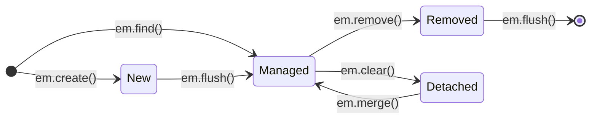
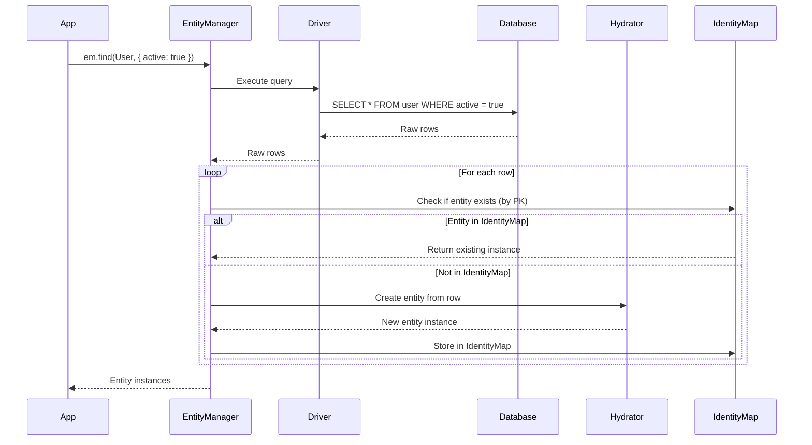
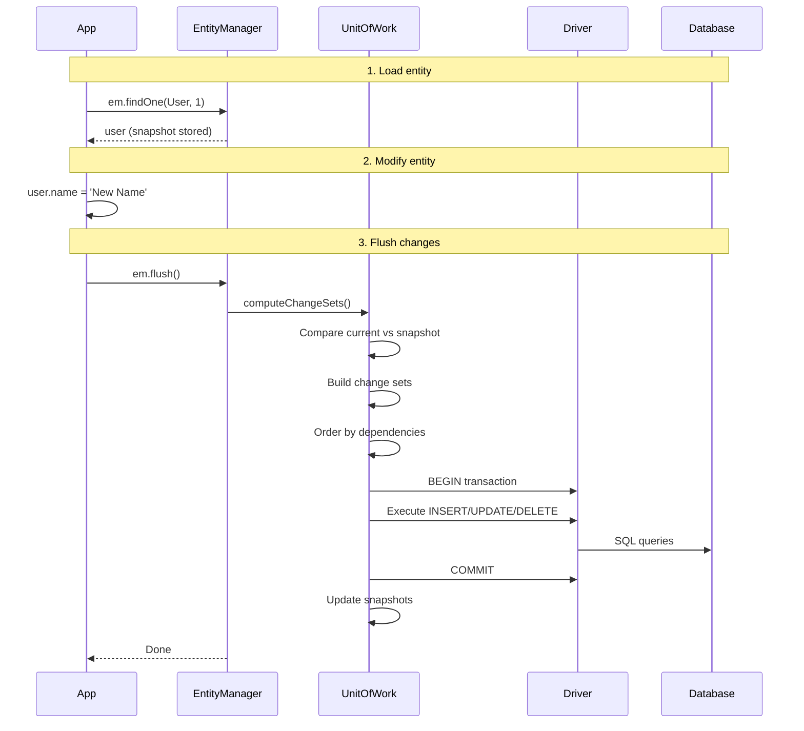

This guide explains how MikroORM works internally. It's intended for users who want a deeper understanding of the ORM's behavior, as well as contributors looking to understand the codebase.

## Core Patterns

MikroORM implements several well-known patterns from Martin Fowler's *Patterns of Enterprise Application Architecture*:

- **[Data Mapper](https://martinfowler.com/eaaCatalog/dataMapper.html)**: Entities are plain objects with no knowledge of the database. The ORM handles all persistence logic.
- **[Unit of Work](https://martinfowler.com/eaaCatalog/unitOfWork.html)**: Tracks all changes made to entities during a request and persists them in a single transaction.
- **[Identity Map](https://martinfowler.com/eaaCatalog/identityMap.html)**: Ensures that each database row is represented by exactly one entity instance within a request context.

## Key Components

| Component | Responsibility |
|-----------|---------------|
| **EntityManager** | Main facade for all ORM operations. Provides `find`, `persist`, `remove`, `flush` methods. |
| **UnitOfWork** | Tracks entity changes, computes change sets, orders queries, manages transactions. |
| **IdentityMap** | Caches entity instances by primary key. Ensures one instance per database row. |
| **MetadataStorage** | Holds entity definitions (properties, relations, indexes) discovered at startup. |
| **Hydrator** | Converts database rows into entity instances. |
| **Driver** | Abstracts database-specific operations (SQL vs MongoDB). |
| **QueryBuilder** | Builds and executes queries programmatically (SQL drivers only). |

## Statefulness and Request Context

MikroORM is **stateful** by design. The EntityManager maintains an IdentityMap that accumulates entities throughout its lifetime. This is intentional - it enables change tracking and ensures entity identity.

However, this means **you must not share a single EntityManager across multiple requests**. Doing so would:
- Cause memory to grow unbounded
- Lead to stale data
- Create race conditions in concurrent requests

The solution is to **fork the EntityManager** for each request:

```ts
// In middleware or request handler
const em = orm.em.fork();
```

For convenience, MikroORM provides the `RequestContext` helper that uses Node.js `AsyncLocalStorage` to automatically provide request-scoped EntityManager instances:

```ts
app.use((req, res, next) => {
  RequestContext.create(orm.em, next);
});

// Later in your code - automatically uses the forked EM
const users = await orm.em.find(User, {});
```

See [Identity Map and Request Context](./identity-map.md) for full details.

## Entity Lifecycle

Entities exist in one of several states relative to the EntityManager:

<div style={{textAlign: 'center'}}>



</div>

| State | Description |
|-------|-------------|
| **New** | Entity created via `em.create()` or constructor. Will be inserted on next `flush()`. |
| **Managed** | Entity is tracked by the UnitOfWork. Changes will be detected and persisted on `flush()`. Entities become managed after being loaded from the database or after `flush()` inserts them. |
| **Detached** | Entity is not tracked by any UnitOfWork. Either explicitly via `em.clear()`, or because it belongs to a different EntityManager fork. Use `em.merge()` to re-attach. |
| **Removed** | Entity scheduled for deletion via `em.remove()`. Will be deleted on next `flush()`. |

## Query to Entity: Hydration

When you query the database, MikroORM transforms raw rows into entity instances through a process called **hydration**:



Key points about hydration:

1. **IdentityMap check first**: Before creating a new instance, the ORM checks if an entity with that primary key already exists in the IdentityMap.
2. **Single instance guarantee**: You always get the same object reference for the same database row within one request context.
3. **Relation references**: Related entities are initially loaded as **references** (objects with only the primary key). They become fully loaded when populated.
4. **State snapshot**: The hydrated state is stored internally for later change detection.

## Entity to Database: Change Tracking and Flush

MikroORM uses a **snapshot-based** change tracking approach. When an entity is hydrated or persisted, the ORM stores a copy of its state. On flush, it compares the current state against this snapshot:



The flush operation:

1. **Computes change sets**: Compares current entity state against stored snapshots.
2. **Orders queries**: Uses topological sort to respect foreign key constraints.
3. **Batches operations**: Groups INSERTs, UPDATEs, and DELETEs for efficiency.
4. **Wraps in transaction**: All changes are committed atomically.
5. **Updates snapshots**: After successful commit, snapshots are updated to reflect the new state.

See [Unit of Work](./unit-of-work.md) for flush modes and transaction details.

## Populating Relations

Relations are not loaded automatically. By default, a relation property contains only a **reference** - an object with the primary key but no other data:

```ts
const book = await em.findOne(Book, 1);
console.log(book.author);       // Reference: { id: 5 }
console.log(book.author.name);  // undefined - not loaded!
```

To load related entities, use the `populate` option:

```ts
const book = await em.findOne(Book, 1, { populate: ['author'] });
console.log(book.author.name);  // 'John Doe' - loaded!
```

### Loading Strategies

MikroORM supports three loading strategies:

| Strategy | Description | Best For |
|----------|-------------|----------|
| **`select-in`** | Separate query per relation level using `IN` clause | To-many relations, avoiding cartesian explosion |
| **`joined`** | Single query with JOINs | To-one relations, when you need filtering |
| **`balanced`** (default) | Uses `joined` for to-one, `select-in` for to-many | General purpose, best of both worlds |

```ts
// Using specific strategy
const books = await em.find(Book, {}, {
  populate: ['author', 'tags'],
  strategy: LoadStrategy.JOINED,
});
```

See [Loading Strategies](./loading-strategies.md) for detailed comparison.

## QueryBuilder: Raw vs Hydrated Results

The QueryBuilder (SQL drivers only) provides two ways to get results:

### `qb.execute()` - Raw Data

Returns plain JavaScript objects directly from the driver. Does **not** use the IdentityMap or hydration:

```ts
const rows = await em.createQueryBuilder(User)
  .select(['id', 'name'])
  .where({ active: true })
  .execute();

// rows = [{ id: 1, name: 'John' }, { id: 2, name: 'Jane' }]
// These are plain objects, not entity instances
```

### `qb.getResult()` - Hydrated Entities

Returns fully hydrated entity instances, registered in the IdentityMap:

```ts
const users = await em.createQueryBuilder(User)
  .select('*')
  .where({ active: true })
  .getResult();

// users = [User { id: 1, name: 'John' }, User { id: 2, name: 'Jane' }]
// These are managed entities, changes will be tracked
```

Use `execute()` for read-only queries where you don't need change tracking. Use `getResult()` when you need to work with entities.

See [QueryBuilder](./query-builder.md) for full documentation.

## Serialization

MikroORM provides two approaches to converting entities to plain objects:

### Implicit Serialization

When you call `toJSON()` or `toObject()` on an entity, serialization is driven by the `populate` hints used when loading:

```ts
const user = await em.findOne(User, 1, {
  populate: ['books'],
  fields: ['name', 'books.title'],
});

const dto = wrap(user).toObject();
// Only includes: id, name, books[].id, books[].title
```

Key behaviors:
- Only populated relations are serialized as objects
- Unpopulated relations serialize as foreign key values
- The `fields` option controls which properties appear in output

### Explicit Serialization

For full control, use the `serialize()` helper:

```ts
import { serialize } from '@mikro-orm/core';

const dto = serialize(user, {
  populate: ['books', 'profile'],
  exclude: ['password'],
  forceObject: true,
});
```

This ignores the original populate hints and lets you specify exactly what to include.

See [Serializing](./serializing.md) for all options including serialization groups.

## Driver Architecture

MikroORM uses a driver abstraction to support multiple databases. The `@mikro-orm/core` package contains database-agnostic logic (EntityManager, UnitOfWork, IdentityMap), while driver packages provide database-specific implementations.

**SQL drivers**: `@mikro-orm/postgresql`, `@mikro-orm/mysql`, `@mikro-orm/mariadb`, `@mikro-orm/sqlite`, `@mikro-orm/libsql`, `@mikro-orm/mssql` - all with full QueryBuilder support.

**MongoDB driver**: `@mikro-orm/mongodb` - uses the native MongoDB driver. No QueryBuilder (use `em.find()` with filter objects instead).

| Feature | SQL Drivers | MongoDB Driver |
|---------|-------------|----------------|
| QueryBuilder | Full support | Not available |
| Transactions | ACID transactions | MongoDB transactions (4.0+) |
| Relations | Foreign keys, JOINs | References, no JOINs |
| Migrations | Schema diffing | Not needed (schemaless) |
| M:N Relations | Pivot tables | Array of references on owning side |

Most MikroORM features work identically across drivers. The main difference is that MongoDB lacks JOIN support, so filtering by related entity properties is not supported - you need to query from the owning side or denormalize your data.

## Event System

MikroORM fires events at key points in the entity lifecycle. Available events:

- **Entity**: `onInit`, `onLoad`, `beforeCreate`, `afterCreate`, `beforeUpdate`, `afterUpdate`, `beforeDelete`, `afterDelete`, `beforeUpsert`, `afterUpsert`
- **Flush**: `beforeFlush`, `onFlush`, `afterFlush`
- **Transaction**: `beforeTransactionStart`, `afterTransactionStart`, `beforeTransactionCommit`, `afterTransactionCommit`, `beforeTransactionRollback`, `afterTransactionRollback`

Events can be handled via **lifecycle hooks** (decorators on entity methods) or **event subscribers** (separate classes).

```ts
@Entity()
class User {
  @BeforeCreate()
  setCreatedAt() {
    this.createdAt = new Date();
  }
}

// Or via subscriber
class UserSubscriber implements EventSubscriber<User> {
  getSubscribedEntities() {
    return [User];
  }

  beforeCreate(args: EventArgs<User>) {
    args.entity.createdAt = new Date();
  }
}
```

See [Events and Hooks](./events.md) for the complete event reference.

## Further Reading

- [Entity Manager](./entity-manager.md) - Working with the EntityManager API
- [Unit of Work](./unit-of-work.md) - Change tracking and flush modes
- [Identity Map](./identity-map.md) - Request context and forking
- [Populating Relations](./populating-relations.md) - Loading related entities
- [Loading Strategies](./loading-strategies.md) - Joined vs select-in strategies
- [Serializing](./serializing.md) - Converting entities to DTOs
- [Events and Hooks](./events.md) - Lifecycle events
- [Transactions](./transactions.md) - Transaction management
